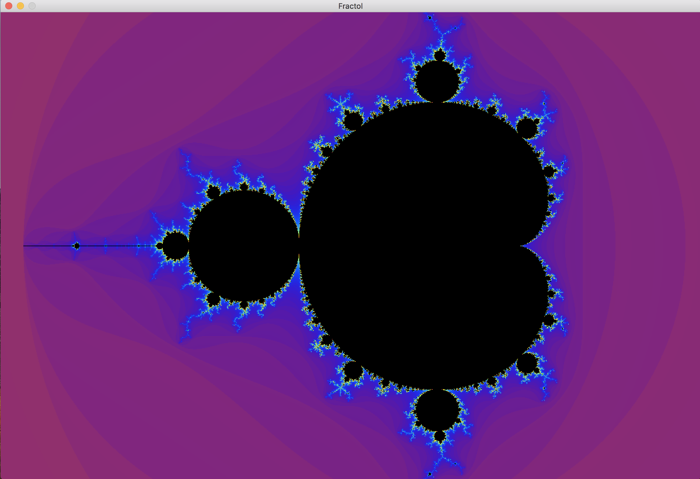
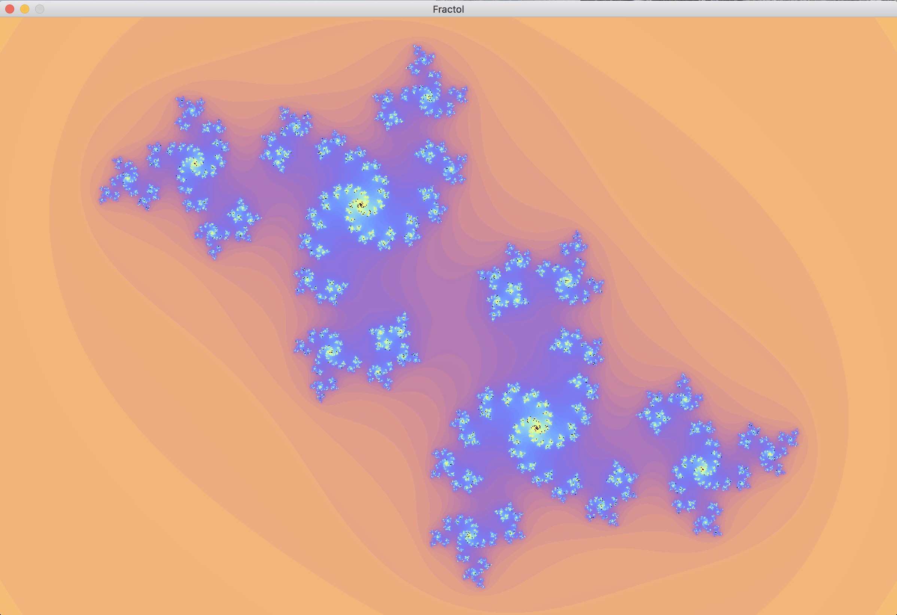
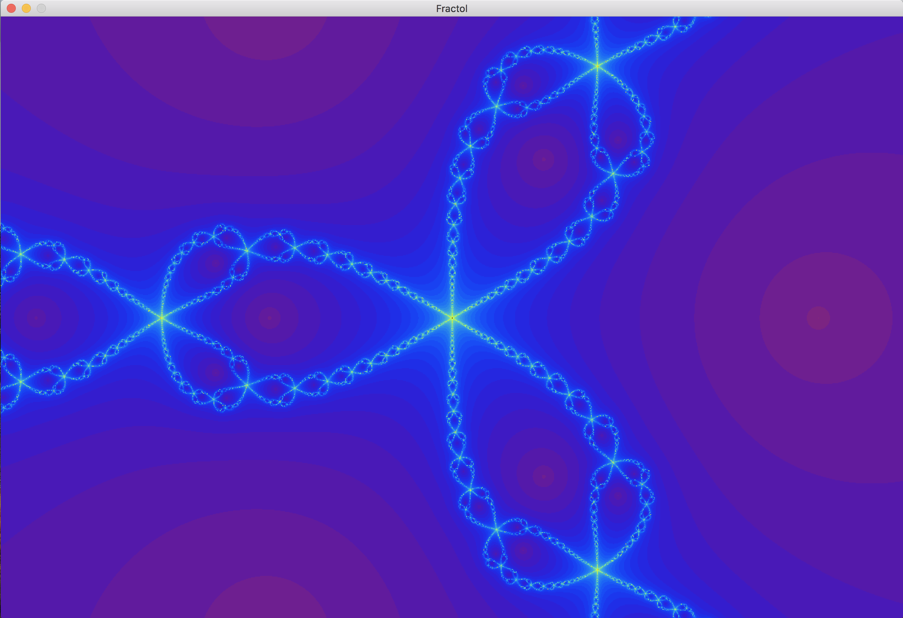
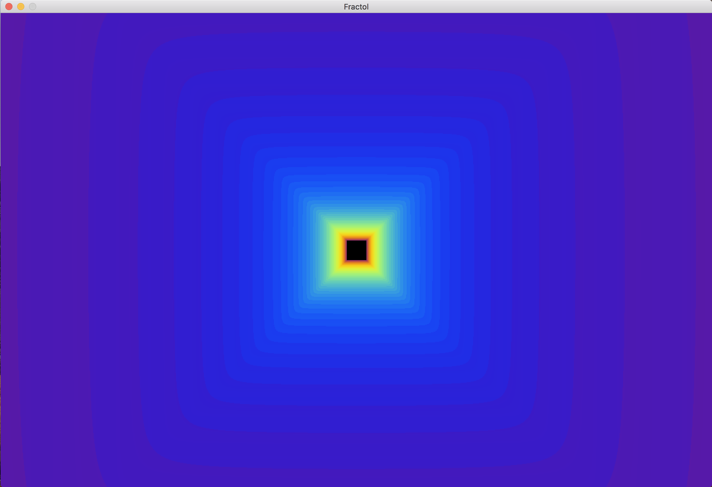

# Fractol
Fractol it's my own fractal visualizer and one of CG project at school42. It use multithreading for calculate and render image.

<h2>Options:<h2>

- move

- zoom

- different colors

- change the number of iterations

